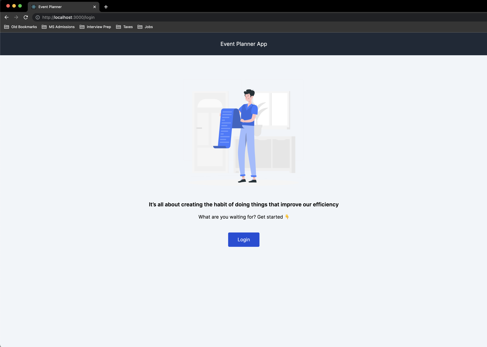
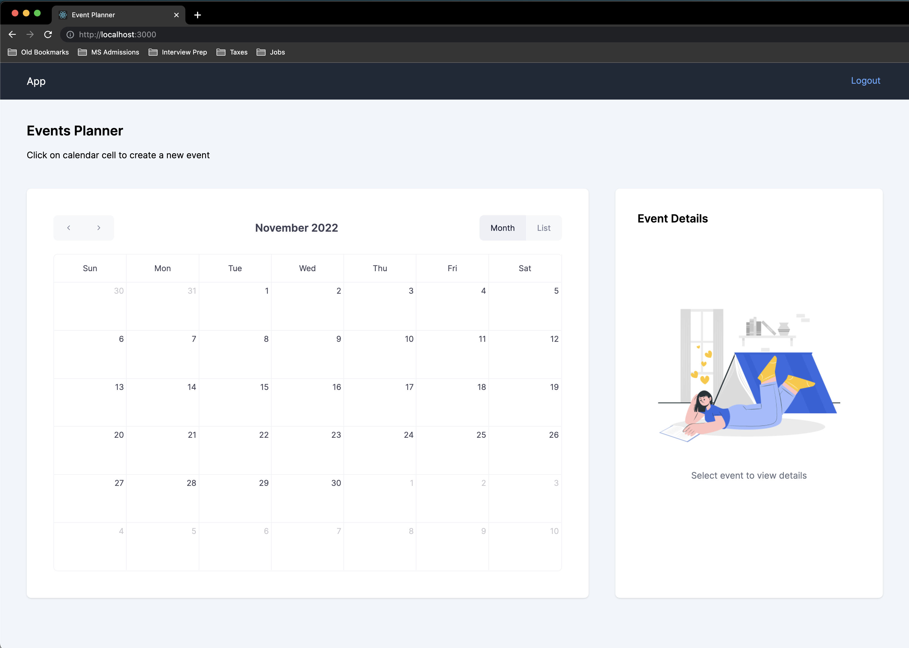
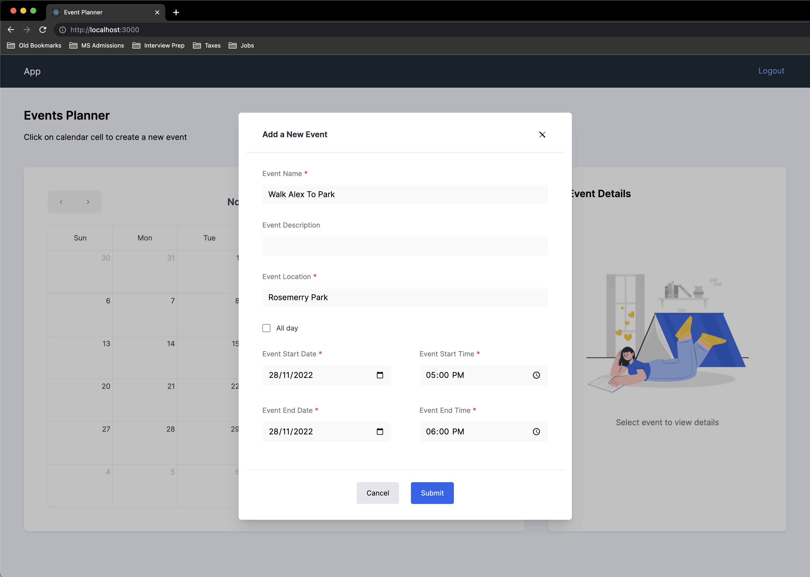
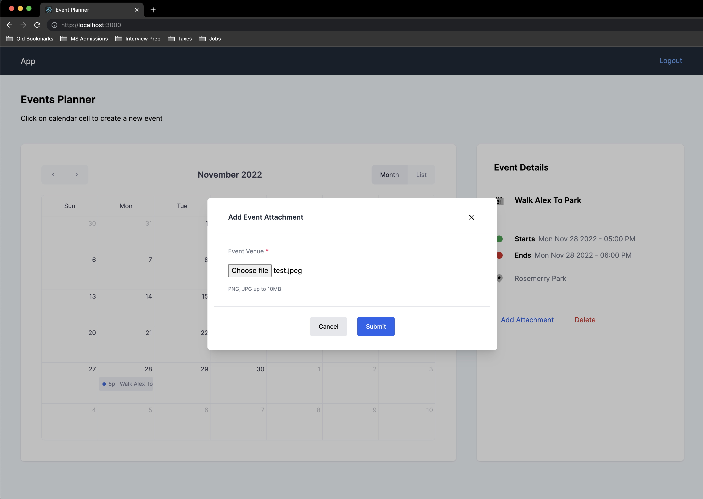
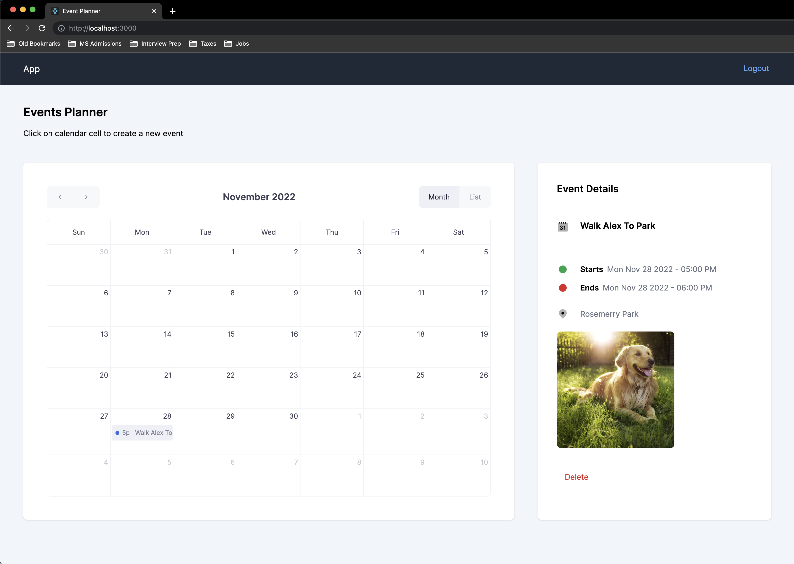

## Event Planner - Serverless Backend
This is full stack project built on top of React Typescript in Frontend & Node Typescript as Backend. The goal of this project was to create & deploy backend to AWS serverless cloud formation. It is final capstone project of Udacity's Cloud Developer Nanodegree.

### Functionality of Application

It allows creating/fetching/removing Calendar events. Each Event can optionally have an attachment image of venue. User has access to only those calendar events which were created by him/her.

#### Event item

The application stores Events, and each Event contains following field:

- `todoId` (string) - a unique id for an event
- `userId` (string) - a unique id of user who has created event
- `createdAt` (string) - date and time when an event was created
- `title` (string) - name of a Event item (e.g. "Meeting with Chris")
- `description` (string) (optional) - a short description of the event
- `location` (string) - venue of the event
- `start` (Date Time string) - start date & time of the event
- `end` (Date Time string) - end date & time of the event
- `attachmentUrl` (string) (optional) - a URL pointing to an image attached to a Event

### Project Setup

To run the Frontend locally, follow below steps after cloning the repository `master` branch:

1. open `client` directory in terminal.
2. run `npm install` to download all project dependencies.
3. run `npm start` to launch application in browser [http://localhost:3000](http://localhost:3000) 

> It is required to have port `3000` available for application, else the auth functionalities will not work.

### Application Screenshots

**Login View**

**Home Page View**

**Adding New Event**

**Add Event Attachment**

**Home Page Event View**

